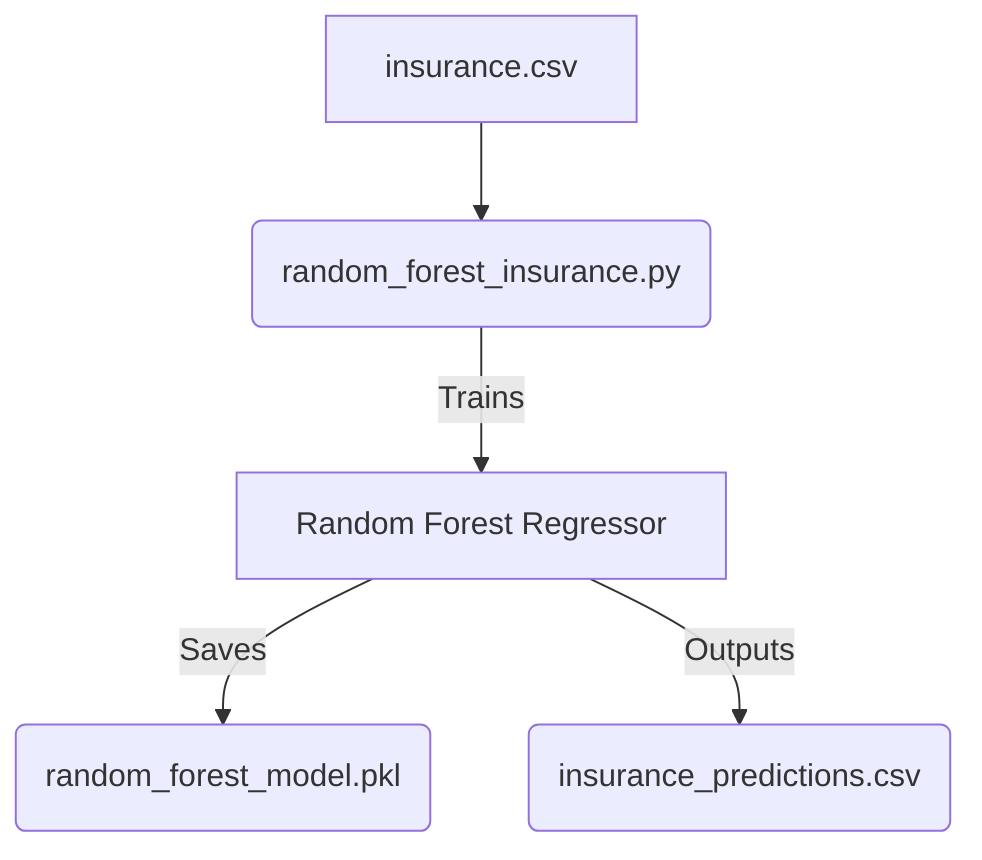

# 🌲 Random Forest Insurance Predictor

An applied Machine Learning project utilizing Random Forest regressors to estimate insurance premiums.

## 🏗 Architecture & Workflow
The repository contains the complete end-to-end ML pipeline artifacts.
- **Training Logic**: `random_forest_insurance.py` contains the scikit-learn training loop.
- **Artifacts**: The trained model is serialized as `random_forest_model.pkl` for immediate deployment without retraining.
- **Output**: Generates `insurance_predictions.csv` for downstream analysis.



## 🛠 Usage Instructions
1. **Setup Environment**:
   ```bash
   pip install -r requirements.txt
   ```
2. **Run Predictions/Training**:
   ```bash
   python random_forest_insurance.py
   ```
3. **Deploy**:
   The `.pkl` file can be loaded via `joblib` into any Flask or FastAPI backend for serving real-time inferences.
